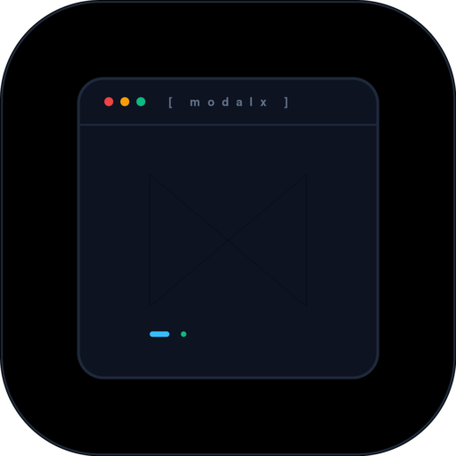

<p align="center">
  
</p>

# modalx

[](https://crates.io/crates/modalx)
[](https://modalx.oguzhanumutlu.com)
[](https://docs.rs/modalx)
[](LICENSE)

A responsive, declarative, box-encapsulated Terminal User Interface (TUI) and modal dialog engine for Rust, built directly on [crossterm](https://crates.io/crates/crossterm).

```
╭──────────────────────────────────────────────────────────────────────────────╮
│                     WORKSPACE & PIPELINE CONTROLLER                          │
├──────────────────────────────────────────────────────────────────────────────┤
│  Project: nexus-core | Branch: feat/async-worker | Target: x86_64-musl       │
│  Environment: Staging | Health: Nominal (99.9%) | Active Workers: 8          │
├──────────────────────────────────────────────────────────────────────────────┤
│  > [1]   Run Build & Verification Pipeline                                   │
│    [2]   Interactive Test Suite (51 passed)                                  │
│    [3]   Database Schema Migrations                                          │
│    [4]   Deploy Staging Canary Artifact                                      │
│    [5]   Inspect Telemetry & Real-Time Logs                                  │
│    [6]   Workspace Configuration & Secrets                                   │
├──────────────────────────────────────────────────────────────────────────────┤
│  [↑/↓/j/k] Navigate  |  [Enter] Execute  |  [Esc] Back  |  [q] Quit          │
╰──────────────────────────────────────────────────────────────────────────────╯
```

---

## Core Capabilities

- **Strict Unicode Box Encapsulation**: All visual content is strictly contained within Unicode borders (`╭─╮`, `│ │`, `├─┤`, `╰─╯`) with automatic ASCII fallback, horizontal and vertical centering, and full row clearing. Boundaries never clip, overflow, or break terminal line layouts.
- **Responsive Terminal Protection**: Detects constrained viewports (< 60 columns x 14 rows), pauses execution with a centered warning card, and automatically resumes on resize.
- **Dynamic Greedy Reflow**: Delimited metadata tokens (e.g. `Branch: main | Target: Release | Status: Ready`) dynamically wrap across multiple framed lines rather than truncating with ellipses.
- **Full Modal Library**:
  - `SelectModal`: Searchable, paginated keyboard-driven menus with hotkeys and vim navigation.
  - `FormModal`: Multi-field forms with real-time validators, keystroke force-validators, interactive checkboxes (`[Space]` toggle), masked password fields, integer/numeric constraints, dynamic vertical scrolling, quick save (`Ctrl+S`), and unsaved changes confirmation.
  - `InputModal`: Readline text editing with word jump, character deletion, password masking, and custom validation.
  - `ConfirmModal`: Affirmative/negative prompts with horizontal centering, default focus control, and danger mode styling.
  - `InfoModal`: Multi-line scrollable dialogs with contextual shortcut bars that omit scroll hints when content fits the viewport.
  - `TableModal`: Multi-column tabular data displays with column alignment (Left, Center, Right) and row selection.
  - `WaitingModal`: In-place progress monitors with smooth animated braille spinners, multi-step checklists, and non-blocking Esc cancellation.
  - `ProgressModal`: High-performance transfer and download progress modal with sub-character smooth Unicode blocks (`▏▎▍▌▋▊▉█`), exponential-smoothing speed telemetry, ETA estimation, and double-buffered box frame rendering.
- **Dynamic Shortcuts Engine**: Contextual shortcut bar (`Shortcuts`, `ShortcutBar`) with automatic deduction and formatted bracketed key hints.
- **RAII Terminal Safety**: Process-wide panic hook ensuring raw mode is disabled and cursor visibility is restored on unexpected exits.

---

## Installation

Add `modalx` to your `Cargo.toml`:

```toml
[dependencies]
modalx = "0.1"
```

Or install via Cargo CLI:

```bash
cargo add modalx
```

Or run the quickstart script:

```bash
curl -fsSL https://modalx.oguzhanumutlu.com/install.sh | bash
```

---

## Quickstart

### 1. Interactive Command Center (`SelectModal`)

```rust
use modalx::prelude::*;

fn main() -> modalx::Result<()> {
    let mut selected = 0;

    let modal = SelectModal::new()
        .with_title("WORKSPACE CONTROLLER", false)
        .with_raw_fields("Project: nexus | Target: Release | Status: Ready", " | ")
        .item("1", "Run Build Pipeline")
        .item("2", "Interactive Test Runner")
        .item("3", "Database Schema Migrations")
        .item("4", "Deploy Canary Release")
        .item("q", "Quit");

    match modal.run(&mut selected)? {
        SelectOutcome::Selected(idx) => println!("Selected item: {}", idx),
        SelectOutcome::Cancelled => println!("Selection cancelled."),
        _ => {}
    }

    Ok(())
}
```

### 2. Multi-Field Form with Validation (`FormModal`)

```rust
use modalx::prelude::*;

fn main() -> modalx::Result<()> {
    let modal = FormModal::new("SERVICE CONFIGURATION")
        .field(FormField::string("name", "Service Name").with_default("api-gateway"))
        .field(
            FormField::integer("port", "Listen Port")
                .with_default("8080")
                .with_validator(|val| match val.parse::<u16>() {
                    Ok(p) if p > 1024 => Ok(()),
                    _ => Err("Port must be an unprivileged port (> 1024)".to_string()),
                }),
        )
        .field(FormField::checkbox("tls", "Enable TLS / HTTPS").with_checked(true))
        .field(FormField::string("env", "Environment").with_default("production"))
        .field(FormField::password("secret_key", "API Secret Key"));

    if let FormResult::Submitted(values) = modal.run()? {
        println!(
            "Configuring {} on port {} (TLS: {}, Env: {})",
            values["name"], values["port"], values["tls"], values["env"]
        );
    }

    Ok(())
}
```

### 3. Production Deployment Confirmation (`ConfirmModal`)

```rust
use modalx::prelude::*;

fn main() -> modalx::Result<()> {
    let outcome = ConfirmModal::new(
        "PROMOTE CANARY",
        "Deploy canary build to 100% production traffic?",
    )
    .danger(true)
    .with_detail("This routes live end-user traffic to release v2.4.0 across all regions.")
    .with_yes_label("Promote to Production")
    .with_no_label("Abort Deployment")
    .default_yes(false)
    .run()?;

    if outcome == ConfirmOutcome::Confirmed {
        println!("Deployment initiated.");
    } else {
        println!("Deployment cancelled.");
    }

    Ok(())
}
```

### 4. Tabular Data Browser (`TableModal`)

```rust
use modalx::prelude::*;

fn main() -> modalx::Result<()> {
    let mut selected_row = 0;

    let columns = vec![
        TableColumn::new("PID", 8).right_aligned(),
        TableColumn::new("Process Name", 24),
        TableColumn::new("Memory (MB)", 14).right_aligned(),
        TableColumn::new("CPU (%)", 10).right_aligned(),
        TableColumn::new("Status", 12),
    ];

    let rows = vec![
        vec!["1042".into(), "systemd".into(), "48.2".into(), "0.1".into(), "Running".into()],
        vec!["2180".into(), "dockerd".into(), "312.5".into(), "1.4".into(), "Running".into()],
        vec!["3401".into(), "postgres".into(), "524.8".into(), "2.1".into(), "Running".into()],
        vec!["4892".into(), "redis-server".into(), "84.1".into(), "0.3".into(), "Running".into()],
        vec!["6720".into(), "worker-pool".into(), "41.6".into(), "0.0".into(), "Running".into()],
    ];

    let modal = TableModal::new("SYSTEM PROCESS INSPECTOR")
        .with_columns(columns)
        .with_rows(rows)
        .with_selectable(true);

    if let TableOutcome::Selected(idx) = modal.run(&mut selected_row)? {
        println!("Selected process index: {}", idx);
    }

    Ok(())
}
```

### 5. Multi-Step Task Monitor (`WaitingModal`)

```rust
use modalx::prelude::*;

fn main() -> modalx::Result<()> {
    let modal = WaitingModal::new("PIPELINE DEPLOYMENT", "Compiling release artifacts...")
        .with_step("Verify dependency checksums", true)
        .with_step("Compile optimized binaries", true)
        .with_step("Execute integration test suite", false)
        .with_step("Publish container images", false);

    modal.render_static(&mut std::io::stdout())?;
    Ok(())
}
```

### 6. Transfer & Download Progress (`ProgressModal`)

```rust
use modalx::prelude::*;
use std::io;

fn main() -> modalx::Result<()> {
    let mut stdout = io::stdout();
    let total_bytes: u64 = 64 * 1024 * 1024; // 64 MB

    let mut modal = ProgressModal::new(
        "DOWNLOADING ARTIFACTS",
        "Fetching distribution archive...",
        total_bytes,
    )
    .with_step("Verify package signature", true)
    .with_step("Stream binary chunks", false);

    modal.render_forced(&mut stdout)?;

    // Incrementally update progress during streaming
    modal.update(32 * 1024 * 1024);
    modal.render(&mut stdout)?;

    modal.finish("Download completed successfully!", &mut stdout)?;
    Ok(())
}
```

---

## Examples

Run any of the included examples:

```bash
# Minimal menu selection
cargo run --example simple_menu

# Responsive dashboard with metadata reflow
cargo run --example dynamic_dashboard

# Multi-step wizard chaining inputs, menus, and confirms
cargo run --example interactive_wizard

# Structured data table viewer
cargo run --example data_table

# Multi-step animated progress spinner
cargo run --example progress_spinner

# Real-time download progress bar with speed and ETA
cargo run --example download_progress
```

---

## Documentation

Comprehensive documentation, architecture guides, and cookbooks are available on the official documentation site:
- Documentation: [modalx.oguzhanumutlu.com](https://modalx.oguzhanumutlu.com)
- API Reference: [docs.rs/modalx](https://docs.rs/modalx)

---

## License

MIT (c) Oguzhan Umutlu
